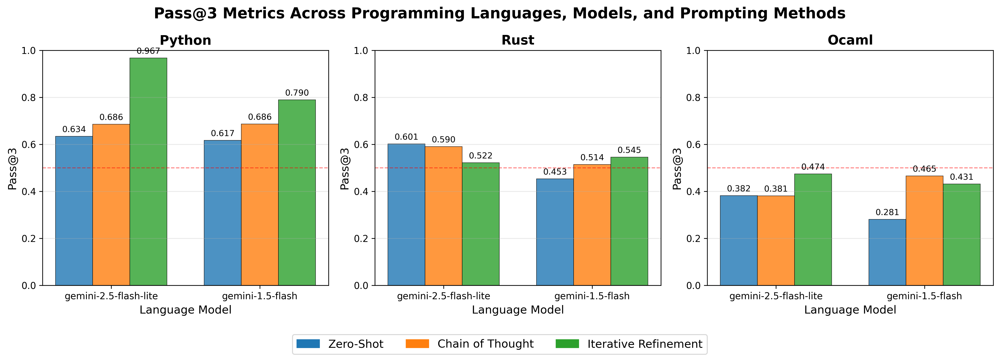

# EN.601.727 Machine Programming – Assignment 2

🚀 Welcome to Assignment 2!

In this milestone, you’ll step into the role of a researcher evaluating LLMs for program synthesis.
Unlike Assignment 1 (where you built your own synthesizers), here your job is to carefully evaluate how well different large language models (LLMs) synthesize executable programs across programming languages and prompting strategies.

Think of this as running a mini “paper experiment”:
you’ll design prompts,
run controlled evaluations across multiple LLMs and multiple programming languages,
collect results into structured reports,
and present findings with visualizations.
This assignment is less about coding a synthesizer, and more about rigorous evaluation.

### ✨ Structure

This assignment has four parts:
1. Execution Environments: Set up runners for synthesized Python, Rust, and OCaml programs. (`synthesizer_python.py`, `synthesizer_rust.py`, `synthesizer_ocaml.py`)
2. Prompting Strategies: Implement and study four prompting strategies (Zero-shot, Chain-of-Thought, Iterative refinement with feedback, and one of your own custom strategy 🎨) (`synthesizer.py`)
3. Evaluation Pipeline: Build an evaluation driver that iterates over the dataset, invokes the synthesizer, and executes the synthesized program on test inputs/outputs, records metrics and statistics (`evaluate.py`). You’ll run this pipeline across 2 LLMs × 3 languages × 4 prompting strategies = 24 experiments.
4. Visualization: Run the visualization to create a main figure comparing LLM performance across setups. In addition, you will implement at least one custom visualization of your choice (e.g., `pass@k`, error modes, refinement success, etc.) (`visualize.py`)

### 📦 Deliverables and Submission

Your submission must include:

Code Files
- `synthesizer.py`
- `synthesizer_python.py`
- `synthesizer_rust.py`
- `synthesizer_ocaml.py`
- `evaluate.py`
- `visualize.py`

Experiment Reports (JSONL)
- `reports/`
  - `python_zero_shot_gemini-1.5-flash.jsonl`
  - … (one file per experiment, 24 in total)

Figures
- `visualizations/main_figure.png`
- `visualizations/YOUR_OWN_FIGURE.png`

Optional
- `acknowledgements.md` (collaboration notes, AI usage, credits)
- Other files that you have altered

> *Note*: It is okay to modify the project files beyond the functions we ask you to implement.
> In such case, please also submit these files for our reference, especially when autograder depends on such files.

### 📌 Grading Criteria

**Autograder (80%)** (mechanical checks)
- (12%) All required Python files submitted
- (20%) Execution contexts for Python, Rust, and OCaml tested
- (48%) 24 experiment reports present

**Manual Grading (20%)** (conceptual checks)
- (5%) Prompting strategies correctly implemented
- (5%) Reported metrics are reasonable (don’t worry if performance is low!)
- (10%) Visualizations present and meaningful

### Collaboration Policy

You are encouraged to discuss ideas with peers.
Do not copy code directly.
Implement your own solution.
If you collaborate (e.g., pair programming, brainstorming), credit your collaborators clearly in your `acknowledgements.md`.

### 🤖 Using AI in This Assignment

LLMs are not just allowed—they’re part of the assignment!
I strongly encourage you to use LLMs to help with setup, especially when you are unfamiliar with Rust/OCaml environments.
For evaluation and prompting, make sure you control the experiments.
Don’t fake results—failures are as important as successes.
Similar to what we have done in Assignment 1, please record what you find to be interesting.

### 🔑 LLM API Key

For this assignment, we will provide each of you with a Google Gemini API key. 
This key is intended for use only within the context of this course. 
Please do not share it with others, especially outside of the class. We will monitor usage, and in cases of excessive or inappropriate use, keys may be revoked.
Once you receive your key, you can set it as an environment variable so that your programs can access it. For example, in a Unix-like shell you can run:

``` bash
export GEMINI_API_KEY="your_api_key_here"
```

Be mindful that you may occasionally encounter temporary rate limits due to traffic, or our shared account may run low on available credit. 
If that happens, you are encouraged to notify us by email or through a Courselore post so we can issue new keys as needed. To avoid delays, you also have the option of registering a personal Google account and claiming the free $300 credit offered through [Google Vertex AI](https://cloud.google.com/vertex-ai), which will allow you to generate your own API key for use in the assignment.

### 🧭 Integrity Guidelines

Do not hardcode answers or "simulate" program outputs.
Record genuine LLM outputs, including failures.
Visualizations must be based on your actual experiments.
Please don’t post solutions online.

# Part 0: Setting Up

Let's again get your environment ready.

1. **Clone the repository**

  ```bash
  git clone https://github.com/machine-programming/assignment-2
  ```

2. **Create a virtual environment and install dependencies**

  ```bash
  cd assignment-2
  python -m venv .venv # creating a virtual environment
  source .venv/bin/activate # change this to other activate scripts (e.g. activate.fish) if you are using other shells (e.g. fish)
  pip install -r requirements.txt
  ```

3. **Test your Python evaluation setup**

  ```
  python test_evaluate_python.py

  ...
  ----------------------------------------------------------------------
  Ran 9 tests in 0.325s

  FAILED (failures=9)
  ```
  this is normal

4. **Install Rust and OCaml Environments**

Install Rust and OCaml environments

- **Rust**: Install via [rustup](https://www.rust-lang.org/tools/install). Make sure `cargo` is available after installation —it’s the Rust package manager and build tool. After installation, try checking that it is installed by typing `cargo --version` in your command line
- **OCaml**: Install via [opam](https://ocaml.org/install). After installation, ensure you have the command `ocaml` available. (Tip: `opam switch` manages OCaml compiler versions.)

💡 If you run into setup issues, try asking an LLM for help—it’s part of the learning experience.
Of course, feel free to come to office hours or post on CourseLore!

# Part 0.5: Understanding the Dataset

Please take a minute to understand the dataset that we are working with.
Our dataset [`data/dataset.jsonl`](data/dataset.jsonl) is a mix of parts of two datasets: [xCodeEval](https://huggingface.co/datasets/NTU-NLP-sg/xCodeEval/tree/main) and [MBPP](https://huggingface.co/datasets/Muennighoff/mbpp).
Each sample looks like the following

``` json
// MBPP Problem #273
{
  "description": "Write a program that implements the following functionality: write a function to substract the contents of one tuple with corresponding index of other tuple.",
  "input_from": "standard input",
  "output_to": "standard output",
  "time_limit": 1.0,
  "memory_limit": "256 megabytes",
  "input_spec": "The input contains two lines, where each line is a tuple of 3 integers separated by spaces",
  "output_spec": "Print the result as space-separated integers",
  "notes": "This problem is based on implementing the substract_elements function. The program should read input from stdin and print the result to stdout.",
  "sample_inputs": [
    "10 4 5\n2 5 18",
    "11 2 3\n24 45 16",
    "7 18 9\n10 11 12"
  ],
  "sample_outputs": [
    "8 -1 -13",
    "-13 -43 -13",
    "-3 7 -3"
  ],
  "tags": [
    "data structures"
  ],
  "src_uid": "mbpp_273",
  "difficulty": 300
}
```

As can be seen, this MBPP question suggests that we should read the input from STDIN, and print the output to STDOUT.
The input contains two lines, where each line is a tuple of 3 integers.
We expect the output to be three integers in the same line, also separated by spaces.
The input-output examples are provided in the fields `sample_inputs` and `sample_outputs`, which you may feed to the synthesizer.
In this data-point, there are three input-output pairs.

The expected Python program for this problem is literally:

``` python
t1 = tuple(map(int, input().strip().split())) # read the first line (e.g., "10 4 5")
t2 = tuple(map(int, input().strip().split())) # read the second line (e.g., "2 5 18")
res = (t1[0] - t2[0], t1[1] - t2[1], t1[2] - t2[2])
print(res[0], res[1], res[2]) # Print the output (e.g., "8 -1 -13")
```

For Rust, it will be pretty different:

``` rust
use std::io::{self, Read};

fn main() {
  let mut input = String::new();
  io::stdin().read_to_string(&mut input).unwrap();
  let mut lines = input.lines();

  // First line -> tuple t1
  let t1: Vec<i32> = lines.next().unwrap().split_whitespace().map(|x| x.parse().unwrap()).collect();

  // Second line -> tuple t2
  let t2: Vec<i32> = lines.next().unwrap().split_whitespace().map(|x| x.parse().unwrap()).collect();

  // Compute subtraction and print
  let res = (t1[0] - t2[0], t1[1] - t2[1], t1[2] - t2[2]);
  println!("{} {} {}", res.0, res.1, res.2);
}
```

This is due to the fact that a Rust program needs to be compiled and thus need a main function.
Further, Rust requires explicit error handling (thus the `unwrap()` functions), adding lots of complexity to input parsing code.
Rust can be pretty functional, as you can tell by the syntax such as `|x| x.parse().unwrap()`.
This is an anonymous function (lambda function) which can translate to something like `lambda x: x.parse()` in Python.

For OCaml, a ML-style functional programming language, the program looks like the following

``` ocaml
let () =
  (* Read the first line and split into ints *)
  let line1 = read_line () in
  let t1 = line1 |> String.split_on_char ' ' |> List.map int_of_string in

  (* Read the second line and split into ints *)
  let line2 = read_line () in
  let t2 = line2 |> String.split_on_char ' ' |> List.map int_of_string in

  (* Compute differences elementwise *)
  let res = List.map2 ( - ) t1 t2 in

  (* Print as space-separated integers *)
  List.iteri
    (fun i x ->
      if i > 0 then print_string " ";
      print_int x)
    res;
  print_newline ()
```

An OCaml program may start from a `let () = ` expression.
While the main logic is pretty similar, you can observe that there are high-order functional operators such as `List.map` or `List.iteri`, and even some interesting symbols like `|>`.
You may also recognize the anonymous function (lambda function) `fun i x -> ...`, which may translate to `lambda i, x: ...` in Python.

Regarding the other fields within the datapoint:
The `src_uid` is the ID field used to identify the problem.
You may also realize that there are natural language description of the entire function, some notes, as well as the input/outputs.
You can make use of all of these including the sample inputs and outputs, when invoking an LLM-based synthesizer.
The `time_limit` field should be enforced when we execute the program on each input.
We are not going to mandate the memory consumption simply because it is hard to implement, but ususally they are also part of the specifications.
Lastly, there may be information about `tags` and `difficulty` of the problem, which are only auxilliary information for study.

Accompanying this format is our datapoint structure which you are going to be working with.
They are implemented within [`dataset.py`](dataset.py) under the class `ProgramSynthesisDatapoint`.
Your synthesizer will work with the `ProgramSynthesisDatapoint` class.

# Part 1: Evaluating Python/Rust/OCaml Programs

In this part of the assignment, you will set up the environments for Python, Rust, and OCaml, and ensure that synthesized programs can be checked and executed correctly. 
For Python, this means verifying that the program is syntactically valid and produces the correct outputs. 
For Rust and OCaml, you must also handle compilation before running the programs. 
Ultimately, each synthesized program should be able to pass as many test cases as possible, and your evaluator must capture both successes and failures in a structured way.

## Part 1a: Python Environment

Begin with [`synthesizer_python.py`](synthesizer_python.py) and examine the `evaluate` function:

``` py
def evaluate(self, datapoint: ProgramSynthesisDatapoint, synthesized_program: str) -> EvaluationReport:
    """Evaluate Python program with comprehensive execution testing."""
    report = EvaluationReport(synthesized_program)
    
    # Create temporary directory for execution
    with tempfile.TemporaryDirectory() as temp_dir:
        pass
        
    report.finalize()
    return report
```

This function receives a `ProgramSynthesisDatapoint` along with a synthesized program to evaluate. 
Your task is to implement the logic inside the `with` block so that the synthesized program is thoroughly tested. 
The general approach is to create a temporary Python file within the temporary directory, and then use standard tools (including `python` itself) to check its validity and correctness.

For syntax checks, you can rely on Python’s `subprocess` module to run the command `python -m py_compile your_file.py`, which ensures the program compiles without syntax errors. 
For semantic correctness, you will need to run the program on the sample inputs provided in the datapoint and compare its outputs against the expected results. 
Again, `subprocess` is the recommended way to run the program while feeding it the sample input. 
Be careful to enforce a time limit on execution, since infinite loops or very slow programs are possible. 
The `subprocess` module makes it straightforward to impose such limits.

The most important aspect of this evaluator is to construct an accurate `EvaluationReport` that records compilation results, runtime behavior, and test outcomes. 
When errors occur, you should capture and classify them appropriately. 
Syntax errors should be recorded with `report.add_error("compiler", YOUR_MESSAGE)`, 
while runtime errors should be recorded with `report.add_error("runtime", YOUR_MESSAGE)`. 
Any program that exits with a nonzero return code, or fails due to a timeout, should be treated as a runtime error.

If the program runs successfully, you should add the test results to the report. 
For each input/output pair, record whether the program’s actual output matches the expected output. Use the following patterns:

``` python
# When actual output matches expected
report.add_test_result(test_input, expected_output, actual_output, "passed", None)

# When actual output mismatches
report.add_test_result(test_input, expected_output, actual_output, "failed", None)
```

Once your implementation is complete, you can verify it by running the provided test suite:

``` bash
python test_evaluate_python.py
```

This test suite checks your evaluator on both correct and incorrect Python programs. 
You should pass all the tests before moving on.

## Part 1b: Rust Environment

> Before working on this part, make sure you have the cargo command available on your system. cargo is the standard build tool and package manager for Rust, and it will be central to how you compile and run synthesized programs.

Open [`synthesizer_rust.py`](synthesizer_rust.py) and look at the `evaluate` function. 
Its structure should mirror the Python evaluator from Part 1a, but since you are now dealing with Rust, you will rely on `cargo` for compilation and execution.

There are several ways to compile and run a Rust program containing a main function. 
The simplest and most conventional approach is to create a small project layout that matches Cargo’s expectations. 
Your temporary directory should look like this:

```
TEMPORARY_FOLDER/
  ├── src/
  │   └── main.rs    # contains the synthesized program’s main function
  └── Cargo.toml     # minimal configuration for the Rust project
```

A minimal `Cargo.toml` file can look like this:

```
[package]
name = "main"
version = "0.1.0"
edition = "2021"
```

With this setup in place, you can use the subprocess module to invoke Cargo commands. The following will be especially useful:

- `cargo check` verifies that the program compiles without producing a binary.
- `cargo build` compiles the program and produces an executable.
- `cargo run` runs the program; if no executable is built yet, Cargo will build it first.

Just like in the Python evaluator, you should capture and classify errors carefully. 
A failure at the `cargo check` or `cargo build` stage should be recorded as a compilation error, while runtime errors, nonzero exit codes, or timeouts during `cargo run` should be recorded as runtime errors. 
Successful runs should be compared against the provided sample inputs and outputs, and the results should be added to the `EvaluationReport`.

You are free to set up the Rust evaluation environment in another way if you prefer, but your implementation must still respect the same reporting conventions used in Part 1a. 
Once you finish, test your evaluator using the provided unit tests:

``` bash
python test_evaluate_rust.py
```

If everything is implemented correctly, all tests should pass.

## Part 1c: OCaml Environment

> Before starting this part, ensure that you have either the ocaml or ocamlc command available on your system. These are the standard tools for compiling and running OCaml programs.

Open [`synthesizer_ocaml.py`](`synthesizer_ocaml.py`) and look at the evaluate function. Its overall structure should be the same as the evaluators you implemented for Python and Rust. 
The key difference is that you will now be working with OCaml programs, which means you must rely on ocaml or ocamlc when using the subprocess module.

There are several ways to compile and run an OCaml program. 
Unlike Rust, you do not need to create a project folder with a configuration file; a single `.ml` file is sufficient. 
For more complex workflows, you could use `dune`, which is OCaml’s build system and package manager, but for this assignment the direct commands are enough. 
Some useful commands include:

- `ocamlc YOUR_PROGRAM.ml -o EXECUTABLE` compiles the program into an executable file, which you can run directly afterward.
- `ocamlc -c YOUR_PROGRAM.ml` compiles the program to check for syntax and type errors, but does not produce an executable.
- `ocaml YOUR_PROGRAM.ml` compiles and runs the program immediately without creating a separate binary.

As in Parts 1a and 1b, your evaluator should handle errors and test results consistently. 
Compilation failures should be reported as compiler errors, while runtime errors, nonzero exit codes, and timeouts should be recorded as runtime errors. 
When the program runs successfully, you should compare its outputs against the expected outputs from the datapoint and log the results in the `EvaluationReport`.

Once your implementation is complete, test it with the provided unit tests:

``` bash
python test_evaluate_ocaml.py
```

If your evaluator is correct, you should pass all the test cases.

# Part 2: Prompting Strategies

In this part of the assignment, you will implement four prompting strategies inside the file [`synthesizer.py`](synthesizer.py).
Each strategy requires careful thought not only about how to structure the input into a prompt, but also about how to ensure the output follows a consistent format. 
Since the raw LLM response is unstructured, you will need a reliable protocol to extract a well-formed Python, Rust, or OCaml program from the model’s output.

## Part 2a–b: Zero-Shot and Chain-of-Thought

Begin by looking at the functions `zero_shot` and `two_step_chain_of_thought`. 
These functions receive a `ProgramSynthesisDatapoint` and should return a string containing the full text of the synthesized program. 
Your implementation must craft prompts, send them to the model, and then return the generated program. 
In the case of two-step chain-of-thought prompting, you will need to structure this as two interactions with the model.

To query the LLM, use the method already available in the codebase: `self.model.generate_content(...)`. 
The object `self.model` is configured as a `GeminiClient`, which wraps the Gemini API. 
You should consult the [Google Gemini Python SDK](https://googleapis.github.io/python-genai#how-to-structure-contents-argument-for-generate-content) for details about structuring the contents and, if needed, about using [system instructions](https://googleapis.github.io/python-genai/#system-instructions-and-other-configs).

## Part 2c: Iterative Refinement with Feedback

The iterative refinement strategy is similar in spirit to zero-shot or chain-of-thought prompting, but with one key addition: feedback. 
After each attempt, you will evaluate the synthesized program using the evaluator you implemented in Part 1. 
If errors occur—such as compilation failures, runtime crashes, or incorrect outputs—these should be provided back to the model as feedback. 
The model can then attempt a corrected version.

The function `iterative_refinement_with_feedback` should structure this process as a loop. 
One convenient way is to maintain a conversation as a sequence of `Content` objects, alternating between `role=user` (problem statements and feedback) and `role=assistant` (synthesized programs). 
Limit the number of refinements to three iterations, and if the program passes all test cases before reaching this limit, stop early.

## Part 2d: Your Own Prompting Method

The final strategy is left to your creativity. 
You should add a new function in `synthesizer.py` that implements a prompting method of your choice. 
Rename the function to match your strategy and make sure it follows the same interface as the others.

Some possible directions include 

1. few-shot prompting with carefully chosen examples, 
2. two-step self-reflection without explicit feedback, 
3. code transpilation through an intermediate language, 
4. structured chain-of-thought reasoning, 
5. tree-of-thought prompting, or 
6. execution-trace reasoning. 

You may also design a hybrid approach that combines simpler strategies. 
The only constraint is that your method should not incur excessive cost—avoid strategies that require more than about five model calls per datapoint.

## Testing Your Prompting Method

To test your implementation, use the provided script `synthesize_one.py`. 
This script lets you run a single synthesis experiment with configurable parameters. For example:

```bash
python synthesize_one.py \
    --model-name gemini-2.5-flash-lite \
    --prompting-method zero_shot \
    --target-language python \
    --datapoint-id c5d19dc8f2478ee8d9cba8cc2e4cd838
```

Here you can adjust the parameters to test different configurations. 
The `--model-name` flag allows you to choose among [Gemini models](https://ai.google.dev/gemini-api/docs/models), or `gemini-2.5-flash-lite` and `gemini-1.5-flash`, to be specific. 
The `--prompting-method` flag should correspond to one of the functions you implemented: `zero_shot`, `two_step_chain_of_thought`, `iterative_refinement_with_feedback`, or your custom method. 
The `--target-language` flag can be set to `python`, `rust`, or `ocaml`. 
Finally, the `--datapoint-id` should be chosen from the `src_uid` field in the dataset located at [`data/dataset.jsonl`](data/dataset.jsonl).

Before moving on, make sure that your method succeeds consistently on an easy datapoint (which is the suggested one `c5d19dc8f2478ee8d9cba8cc2e4cd838`).
This will help you debug your prompt formatting and output extraction early, rather than discovering issues later during large-scale evaluation.

# Part 3: Evaluation

This part is the heart of the assignment: 
you will build and run a full evaluation pipeline that measures how well different prompting strategies and language models synthesize working programs across Python, Rust, and OCaml. 
By the end, you should be able to produce detailed reports and metrics that reflect both per-datapoint performance and aggregate statistics such as `pass@k`.

## Part 3a: Main Evaluation Loop

The evaluation pipeline is built around a two-level nested loop. 
The outer loop iterates through every sample in the dataset, while the inner loop handles multiple synthesis attempts for each sample. 
On each attempt, you will invoke the synthesizer to generate a program, evaluate the program for correctness, and log the outcome.

This logic should be implemented in the function `_evaluate_all_datapoints()` under [`evaluate.py`](evaluate.py).
Each entry in the resulting log corresponds to one datapoint and should record metadata such as its `src_uid`, its difficulty rating, its tags, and the sequence of attempts. 
For each attempt, store the attempt number, the synthesized program, the evaluation report, whether it succeeded or failed, and timing information. 
You should also track two summary values: `passed_at_k`, which is the attempt number at which the program first succeeded, and `best_success_rate`, which captures the highest fraction of passed test cases seen so far. 
The docstring in the starter code shows the exact structure expected in `self.datapoint_logs`, so follow that closely when implementing your loop.

## Part 3b: Pass@k Metrics

Once you have collected evaluation logs, the next step is to compute aggregate statistics. 
In particular, you will implement `_compute_pass_at_k_metrics()` under [`evaluate.py`](evaluate.py), which computes `pass@k` for k = 1, 2, and 3. 
A program is considered a “pass” only if it compiles successfully, runs without errors, and passes all test cases—this is a strict definition. 
For each k, compute the fraction of datapoints that were solved within the first `k` attempts. 
Your function should return a dictionary with entries like `"pass@1": 0.5, "pass@2": 0.7, "pass@3": 0.8`.

This computation is invoked inside `_generate_full_report`, which ties together datapoint-level logs and aggregate metrics into a comprehensive report. 
Before running real experiments, you can try a dry run to test the pipeline without incurring LLM costs. 
The `--dry-run` flag skips actual model calls and instead generates mock results, allowing you to verify that your evaluation logic and data structures are correct. For example:

``` bash
python evaluate.py \
  --dry-run \
  --target-language python \
  --prompting-method zero_shot \
  --model-name gemini-1.5-flash
```

Running with `--dry-run` is a useful debugging step before you commit to full-scale evaluation.

## Part 3c: Running Evaluation

Once your pipeline is working, you will run full experiments across different models, languages, and prompting strategies. 
Each experiment corresponds to a single combination of these factors and can be launched with a command such as:

``` bash
python evaluate.py \
  --target-language python \
  --prompting-method zero_shot \
  --model-name gemini-1.5-flash
```

This command synthesizes Python programs using your zero-shot prompting method with the `gemini-1.5-flash` model. 
The evaluation results are then saved as a JSON report, for example `reports/final_report_python_zero_shot_gemini-1.5-flash.json`. 
If you rerun the same command, the existing report will be overwritten. 
To avoid surprises, make sure you first test your prompting strategy with `synthesize_one.py` and perform a dry run before attempting the full evaluation.

Ultimately, you must run experiments for all combinations: two language models, three target languages, and four prompting strategies. 
In total this comes to 24 experiments. 
You can launch them one by one, but a more efficient approach is to **script the runs** and let them execute overnight using a shell script.
**Remember that you can run experiments in parallel**.

Although the dataset is small (only 16 samples), evaluation still involves a substantial number of model calls. 
Since we are evaluating `pass@3`, each datapoint requires three attempts per experiment. 
Assuming each attempt uses about two LLM calls on average, the full set of experiments involves close to 3,000 model calls. 
If each call takes ten seconds, the total runtime would exceed 6-7 hours if done sequentially. 
For this reason, start early and consider **parallelizing the experiments**.

The default expectation is that you evaluate two different language models, but you are not limited to `gemini-1.5-flash` and `gemini-2.5-flash-lite`. 
You may choose other Gemini models from the [official list](https://ai.google.dev/gemini-api/docs/models), as your API key should work with them. 
Keep in mind, however, that more advanced models such as `gemini-2.5-pro` already incorporate their own reasoning capabilities, which makes some prompting methods—like two-step chain-of-thought—less meaningful. 
In addition, these models tend to be slower and more expensive, often generating long “thinking” traces without noticeably better results.
For a sensible comparison for speed, you might consider pairing `gemini-1.5-flash-8b` with `gemini-1.5-flash`.

# Part 4: Visualization

## Part 4a: Main Figure

Once you have run some experiments, use the visualization tool to inspect your coverage and results. 
Start with a dry summary by running:

``` bash
python visualize.py --summary-only
```

This prints an overview of the experiments you have completed so far and explicitly marks any missing runs. 
Missing entries are reported with zeros in the aggregates so you can quickly see what still needs to be executed. 
For example, you might see output like:

```
Missing experiments (12):
  - python-gemini-2.5-flash-lite-two_step_chain_of_thought
  - python-gemini-2.5-flash-lite-iterative_refinement
  - python-gemini-1.5-flash-zero_shot
  - python-gemini-1.5-flash-iterative_refinement
  - rust-gemini-2.5-flash-lite-two_step_chain_of_thought
  - rust-gemini-2.5-flash-lite-iterative_refinement
  - rust-gemini-1.5-flash-zero_shot
  - rust-gemini-1.5-flash-iterative_refinement
  - ocaml-gemini-2.5-flash-lite-two_step_chain_of_thought
  - ocaml-gemini-2.5-flash-lite-iterative_refinement
  - ocaml-gemini-1.5-flash-zero_shot
  - ocaml-gemini-1.5-flash-iterative_refinement
```

When you have some reports in place, generate your main figure by running:

``` bash
python visualize.py
```

The script will produce a summary plot saved to `visualizations/main_figure.png`. 
The reference image `visualizations/main_figure_ref.png` shows the intended look and feel, but your actual numbers will differ based on your runs. 
Treat this plot as your “paper figure”: it should clearly compare models, languages, and prompting strategies at a glance.



## Part 4b: Your Own Figure

In addition to the main figure, create at least one more plot that investigates a specific question or hypothesis arising from your logs.
Examples include 
- a line chart showing `pass@1`, `pass@2`, and `pass@3` across strategies or models; 
- a distribution of error types to reveal whether most failures are syntactic, compile-time, or runtime; 
- a visualization of execution time stratified by language; or 
- an accuracy curve across refinement steps to study the value of feedback.
Implement this in `visualize.py` by completing `PLOT_YOUR_CUSTOM_FIGURE`, and save the output (for instance as `visualizations/YOUR_OWN_FIGURE.png`). 
The goal is to demonstrate that rich insights can be mined from your existing logs without inventing new experiments; 
good figures tell a story and often suggest the next research question.

```
def PLOT_YOUR_CUSTOM_FIGURE(self, save_path: Optional[str] = None):
    ################################################################################
    # TODO: Part 4b. Create a visualization that studies one aspect of your results.
    # Suggested angles include pass@x curves (x ∈ {1,2,3}), error-type distributions,
    # execution-time comparisons across languages, or accuracy vs. refinement depth.
    ################################################################################
    pass
```

# Part EC: Extra Credit (1% of your overall course grade)

Choose any programming language other than Python, Rust, or OCaml and add support for it by creating a new file (for example, `synthesizer_X.py`). 
Implement an `evaluate` function following the same structure you built in Part 1 so that synthesized programs can be compiled, run, and assessed against test cases. 
To claim the extra credit, produce at least one experimental report using your custom prompting method with a single language model on your chosen language, and include a short note in `extra_credit.md` describing why you selected the language, how you set up the environment, and how your evaluator works.
Remember to submit `extra_credit.md` if you attempt the extra credit.

Languages like C or Java are acceptable, but you are encouraged to explore lower-resource or less common options such as Julia, Scala, Clojure, Racket, or Haskell. 
You do not need to be an expert in the language; rely on the LLM to help you bootstrap the toolchain and author small programs.

# Wrapping Up

At this point you have executed a compact research study on multilingual program synthesis with modern LLMs. 
Take a moment to reflect on the empirical story your results tell. 
Consider whether the dataset feels easy or difficult, whether performance shifts meaningfully across Python, Rust, and OCaml, and how prompting strategies influenced outcomes. 
Examine whether model size or family materially changed `pass@k` and whether `pass@k` itself captures everything you care about, or if complementary metrics—such as partial credit across tests, time to first success, or error-type profiles—add important nuance. 
A short reflection in your submission that distills these lessons will make your findings more coherent and valuable.
